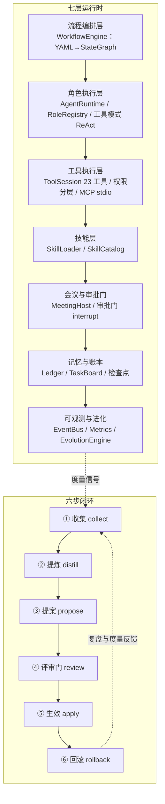

<p align="center">
  
</p>

<h1 align="center">agent-cluster-runtime</h1>

<p align="center"><b>多 Agent 组织型全栈开发集群运行时</b></p>

<p align="center">
  🧠 12 岗位三层治理 ｜ 🗣️ 7 类会议审批门（HITL） ｜ 🔁 YAML 流程 DSL → LangGraph ｜ ⚡ 无 LLM 也可运行
</p>

<p align="center">
  <a href="https://github.com/Natsummerance/agent-cluster-runtime/releases"></a>
  <a href="https://github.com/Natsummerance/agent-cluster-runtime/actions/workflows/ci.yml"></a>
  
  
  
  
  <a href="LICENSE"></a>
</p>

<p align="center">
  设计落地自 <a href="../agent-clusters/智能体集群设计方案.md">智能体集群设计方案（v1.0）</a>
</p>

## 📑 目录

- [✨ 特性速览](#-特性速览)
- [📖 文档](#-文档)
- [🏗️ 架构图](#-架构图)
- [📦 下载与安装（桌面工作台发布版）](#-下载与安装桌面工作台发布版)
- [⚡ 安装与运行](#-安装与运行)
- [💻 CLI 用法](#-cli-用法)
- [🧩 模块导览](#-模块导览)
- [🗺️ 参考项目映射表](#-参考项目映射表)
- [📜 许可与致谢](#-许可与致谢)

## ✨ 特性速览

| 领域 | 能力 |
|---|---|
| 🧠 **组织化多 Agent** | 12 岗位按「决策—管理—执行」三层治理；7 类会议以审批门（HITL interrupt）落地；YAML 流程 DSL 编译为 LangGraph StateGraph；六步进化闭环（收集→提炼→提案→评审→生效→回滚） |
| 🛠️ **真实工具执行** | 23 工具三级权限（read / workspace_write / dangerous）；MCP stdio + Streamable HTTP；Docker 沙箱；git worktree 隔离；有界子代理（token 预算 + max_rounds 双截断） |
| 🖥️ **桌面工作台** | `serve` 后端（REST + SSE + WebSocket）；任务看板三轴仪表盘（成本/进度/健康）；审批弹窗、挂起中断言注入；记忆库四级晋升；审计导出；i18n 中英双语 |
| 🚀 **发布就绪** | 四平台安装包（Windows NSIS / macOS dmg+zip / Linux deb）；electron-updater 自动更新；GitHub Actions 五段 CI 流水线 + 一键 GitHub Release；`agent-delivery` 交付模板 |

## 🧠 项目简介

`agent-cluster-runtime` 是一个「像企业一样运转」的多 Agent 组织型全栈开发集群运行时：
12 个岗位（产品/项目/前端/后端/算法/架构/测试/运维/文档/评审/排查/治理）按「决策—管理—执行」
三层治理组织，7 类会议以审批门（HITL interrupt）落地，YAML 流程 DSL 编译为 LangGraph
StateGraph，跑通「需求评审 → 设计评审 → 开发 → 代码评审 → 测试 → 发布评审」MVP 闭环，
并通过六步进化闭环（收集→提炼→提案→评审→生效→回滚）实现流程/组织级自我进化。

v0.2 新增**工具执行层**：岗位 Agent 不再只输出文本摘要，而是在**真实工作区**里读文件、
改代码、跑测试、走 git——工具按 read / workspace_write / dangerous 三级权限分层，
危险工具走审批门（`--yes` 自动拒绝），模型双轨协议（原生 function calling + 文本 JSON
action 回退），支持 MCP stdio 外部工具，可跑通「空工作区生成可运行新项目」与「既有 git
仓库功能开发」两场景验收。

v0.3 新增**会话式产品构建（`build`）**：输入一个需求，CLI 向导全程交互（PM 主动提问澄清
→ 里程碑门确认 → 验收/发布确认 → 返工/预算指示），在真实工作区产出**完整交付包**（PRD、
架构设计、可运行代码、测试报告、部署产物、用户手册、`DELIVERY.md`）。**规划与计量一律按
token 不按时间**：迭代容量 = token 预算，任务带 token 预估，角色/阶段/产物全量 token 计量，
预算超限升级人工；文件检查点断点续跑（`--resume`）、自动返工 + 上限（默认 3 轮/门）后升级、
混合需求澄清（LLM 提问 + 人工自由文本回答）。

v0.4 新增**连续开发与执行安全层**：`chat` REPL（连续多轮开发：指令关键词自动选岗 +
工具模式真实执行 + 跨轮上下文 + token 计量 + 插件 hooks + 斜杠命令）、**插件层**
（`.codex-plugin` / `.claude-plugin` 双清单合并、11 事件 hooks、marketplace、
`plugins list`）、**模型三协议**（`wire_api`：chat/completions / OpenAI Responses /
Anthropic Messages 自动路由）、`doctor` 环境预检（Python/git/Docker 硬检查）、
**Docker 沙箱**（`--sandbox docker` 容器内执行 shell/python/测试/服务冒烟）、
**git worktree 隔离**（`--worktrees`：每开发角色独立 worktree 提交后合并回主工作区）、
**有界子代理**（`run_subagent`：独立 ReAct 循环 + token 预算 / max_rounds 双截断），
以及工具层扩展（`apply_patch` 结构化补丁 / `http_fetch` URL 抓取 / MCP resources
资源协议 / AGENTS.md 项目记忆）。


v0.5 新增**桌面工作台（Desktop Workbench）**：`serve` 后端（REST+SSE、项目/会话/记忆/度量/
进化/审计全量 API）+ React 工作台前端 + Electron 桌面壳，把一个需求变成全程可视化：
面板实时打断改需求（`interrupt`）、变更版本化回滚（`rollback`）、审批弹窗、任务板/时间线、
token/成本仪表盘、记忆库（SQLite 四级晋升）、进化提案管理、审计导出；CLI 完全保留
（`run`/`build`/`chat`/`demo`/`doctor`/`eval`/`evolution` 等），`agent-cluster demo`
一键确定性生成完整交付包，`npm run dev` + `serve` 即可打开面板即开即用。

v0.6 新增**项目组合层与无人值守验收**：项目容器（多工作区 + 项目级预算池 + 门策略）、
终态会话 `fork` 血缘派生（账本聚合不双计）、任务看板三轴仪表盘（成本/进度/健康）与
指派/过滤、原生 WebSocket 实时面板（subscribe/snapshot/ping/cancel）、挂起中实时
`stdin` 注入（落 transcript/PRD/变更历史）、门策略自动评审（`deterministic-accept`
无人值守跑通全流程）、前端 i18n 中英双语、`e2e:real` 真实后端 Playwright 套件、
Docker 自动安装脚本与 `doctor --fix-docker`、桌面打包矩阵（NSIS x64+arm64 / mac
dmg+zip / linux deb）与 electron-updater 双通道自动更新、GitHub Actions 五段 CI
流水线与 `agent-delivery` 交付模板（build → 人工批准 → 测试 → 发布报告）。

设计要点：

- **流程即配置**：SOP 用可编译的图（YAML → StateGraph）表达，进化 = 重新编译流程，可灰度、可回滚。
- **会议即审批门**：关键决策用 `interrupt`（HITL）落地，人机共治；无人值守（`--yes`）下
  bypass-immune 高风险门自动拒绝（§6.5 自动 DENY）。
- **岗位即技能**：每个岗位 = 角色画像 + 工具集 + SKILL.md 技能包 + 审批权限。
- **可观测是进化的前提**：事件流 + 检查点 + 审批审计 + 绩效度量驱动进化信号。
- **工具即执行**（v0.2）：岗位 Agent 通过受限工作区工具（读/写/git/测试）真实产出代码；
  权限分层 + 路径越界拦截 + 危险工具审批门，执行有边界、可审计。
- **Token 即时间**（v0.3）：计划与度量一律按 token（预算/预估/计量三层），不按时间排期；
  预算超限升级人工，产物/阶段/角色全量可审计。
- **会话即产品**（v0.3）：`build` 一个需求驱动全生命周期，交互向导 + 检查点断点续跑 +
  返工上限 + 交付包（PRD/代码/测试/部署/手册/DELIVERY.md）一次产出。
- **三协议即接入**（v0.4）：`wire_api` 自动路由 chat / responses / anthropic，
  Codex 配置协议优先，stdlib urllib 直连，零新依赖。
- **预检即契约**（v0.4）：`doctor` 把 Python / git / Docker 硬依赖前置检查，
  缺失即给出指引，杜绝「跑到一半才发现环境不对」。
- **开发即会话**（v0.4）：`chat` REPL 连续多轮开发，`/status /budget /skills
  /plugins /exit` 全程可控，token 计量与插件 hooks 自动接入。
- **执行有隔离**（v0.4）：`--sandbox docker` 容器执行 + `--worktrees` 按角色分支
  隔离 + `run_subagent` 有界子代理，并行与安全有边界、可审计。
- **插件即生态**（v0.4）：双清单合并 + 11 事件 hooks（PreToolUse/SessionStart/...），
  对齐 codex-cli 插件契约。

## 📖 文档

- [产品介绍（docs/PRODUCT.md）](docs/PRODUCT.md) —— 定位、特性、架构、岗位/会议/进化机制、技术栈与路线图
- [用户手册（docs/MANUAL.md）](docs/MANUAL.md) —— 安装、CLI 参考、模型接入、流程 YAML 编写、技能/岗位/进化操作、FAQ
- [项目经验库（docs/lessons/README.md）](docs/lessons/README.md) —— 踩坑/根因/预防索引（按需加载，含 3 次即停调试协议）

## 🏗️ 架构图



## 📦 下载与安装（桌面工作台发布版）

无需源码的桌面工作台安装包发布在 [GitHub Releases](https://github.com/Natsummerance/agent-cluster-runtime/releases)
（各版本资产与 Release Notes 见对应 tag，最新版为 [v0.7.1](https://github.com/Natsummerance/agent-cluster-runtime/releases/tag/v0.7.1)）：

- **Windows**：`AgentClusterWorkbench-Setup-0.7.1.exe`（x64+arm64 合并安装包；或按架构的 `Setup 0.7.1 x64.exe` / `Setup 0.7.1 arm64.exe`）
- **macOS**：`AgentClusterWorkbench-0.7.1-<arch>-unsigned.dmg` / `.zip`（x64 与 arm64；本轮未签名，首次打开需右键「打开」绕过 Gatekeeper）
- **Linux**：`AgentClusterWorkbench-0.7.1-amd64.deb`（Debian/Ubuntu x64）

桌面应用内置 electron-updater 自动更新（启动时检查，读 Releases 的 `latest*.yml` 元数据），
小版本升级无需手动下载；CLI 与源码运行方式见下节「安装与运行」。

## ⚡ 安装与运行
前置：Python 3.11+ 与 [uv](https://docs.astral.sh/uv/)（Windows/macOS/Linux 均可）。

```bash
# 1) 安装依赖（首次）与进入虚拟环境
uv sync

# 2) 查看 CLI 帮助（中文）
uv run agent-cluster --help

# 3) 无人值守跑通完整 MVP 闭环（--yes 自动接受全部审批，bypass-immune 门自动拒绝）
uv run agent-cluster run --flow examples/flows/fullstack-sprint.yaml --project examples --yes

# 4) 交互式运行：遇审批门打印请求并读取 accept/reject/response <内容>/edit <内容>
uv run agent-cluster run --flow examples/flows/fullstack-sprint.yaml --project examples

# 5) 会话式构建（v0.3）：一个需求 → 澄清 → 门 → 完整交付包（默认真实 LLM）
#    --deterministic 仅供演示；交互中可用 /status /budget /skip /abort
uv run agent-cluster build --goal "做一个带用户系统的待办事项 Web 应用" \
  --workspace .agent-cluster-demo/ws-build --budget 500000 --model codex

# 6) 断点续跑：Ctrl+C 或 /abort 后，用 --resume 从检查点继续
uv run agent-cluster build --workspace .agent-cluster-demo/ws-build --resume

# 7) 工具模式（v0.2）：空工作区生成可运行新项目（确定性脚本演示，零 key）
#    --max-rounds 需大于脚本步数（脚本 7 步 + 1 轮收尾）
uv run agent-cluster run --flow examples/flows/build-new-project.yaml \
  --workspace .agent-cluster-demo/ws-new \
  --tool-script examples/tool-scripts/build-new-project.json --max-rounds 10 --yes

# 8) 环境预检（v0.4）：doctor 检查 Python/git/Docker 硬依赖（缺失给指引）
uv run agent-cluster doctor

# 9) 连续多轮开发（v0.4）：chat REPL——指令关键词选岗 + 工具模式真实执行
uv run agent-cluster chat --workspace .agent-cluster-demo/ws-chat --deterministic

# 10) 隔离执行（v0.4）：--sandbox docker 容器内执行 + --worktrees 按角色分支隔离
uv run agent-cluster run --flow examples/flows/fullstack-sprint.yaml \
  --workspace .agent-cluster-demo/ws-isolated --sandbox docker --worktrees --yes
```

> 默认确定性模型后端（`DeterministicClient`），无需任何 API key；接入真实 LLM 见下方
> 「接入真实 LLM」一节（DeepSeek / 当前 Codex 模型 / OpenAI）。

### 接入真实 LLM（DeepSeek / 当前 Codex 模型）

运行时支持把岗位执行接入真实 LLM，API key 只从环境变量读取，绝不写入仓库、日志或检查点：

```bash
# 方式一：DeepSeek（cc-switch / DeepSeek 官方端点，模型名 deepseek-*）
#   - 读取环境变量 DEEPSEEK_API_KEY（可从 Codex config.toml 的
#     [model_providers.custom] 自动解析 base_url 与 env_key）
uv run agent-cluster run --flow examples/flows/fullstack-sprint.yaml --project examples   --model deepseek-v4-flash --yes

# 方式二：直接复用「当前 Codex 对话所用模型」（解析 ~/.codex/config.toml，
#   本机配置为 DeepSeek 供应商时自动接入 DeepSeekClient）
uv run agent-cluster run --flow examples/flows/fullstack-sprint.yaml --project examples   --model codex --yes

# 方式三：环境变量兜底（未传 --model 时读取 DEEPSEEK_MODEL）
set DEEPSEEK_MODEL=deepseek-v4-flash   # PowerShell：$env:DEEPSEEK_MODEL='deepseek-v4-flash'
uv run agent-cluster run --flow examples/flows/fullstack-sprint.yaml --project examples --yes
```

- 模型选择优先级：岗位 `Role.model` 偏好 > 运行时 `--model`/`DEEPSEEK_MODEL` 默认模型 > deterministic。
- `deepseek-*` / `codex` 走 `DeepSeekClient`（stdlib urllib 直连 `chat/completions`，无新增依赖）；
  `openai` / `gpt-*` 走 `OpenAIClient`；`deterministic` 走确定性后端（默认，零 API 依赖）。

## 💻 CLI 用法

| 命令 | 说明 |
|---|---|
| `agent-cluster run --flow <yaml> [--project <dir>] [--yes] [--thread <id>] [--model <name>] [--workspace <dir>] [--sandbox none\|docker] [--worktrees] [--mcp NAME=CMD] [--tool-script <json>]` | 编译并运行 YAML 流程；`--yes` 无人值守自动审批；`--model` 指定岗位模型后端（deterministic/deepseek-*/codex）；`--workspace` 启用工具模式（真实工作区执行）；`--sandbox docker` 容器内执行；`--worktrees` 按角色 worktree 隔离；`--mcp` 挂载外部 MCP stdio 工具；`--tool-script` 确定性工具脚本 |
| `agent-cluster chat [--workspace <dir>] [--model <name>] [--sandbox none\|docker] [--deterministic] [--yes] [--plugin-dir <dir>] [--mcp NAME=CMD]` | v0.4 连续多轮开发 REPL：关键词选岗 + 工具模式真实执行 + 跨轮上下文 + token 计量 + `/status /budget /skills /plugins /exit` |
| `agent-cluster doctor [--model <name>] [--workspace <dir>] [--plugin-dir <dir>] [--mcp NAME=CMD] [--skip-docker-check]` | v0.4 环境预检：Python/git/Docker 硬检查 + 模型/工作区/插件/MCP 信息性检查 |
| `agent-cluster plugins list [--plugin-dir <dir>]` | v0.4 列出发现的插件、技能与 hooks（双清单 + marketplace） |
| `agent-cluster tools list` | 列出 23 个内置工具与权限分层（read/workspace_write/dangerous/human_interaction） |
| `agent-cluster mcp list --server NAME=CMD` | 连接 MCP stdio 服务器并列出其工具 |
| `agent-cluster skills list --root <dir>` | 列出技能目录（name/version/description） |
| `agent-cluster roles list` | 列出 12 岗位（id/name/kind/approval_scope） |
| `agent-cluster proposals demo` | 六步进化闭环演示（collect→distill→propose→review→apply→rollback） |
| `agent-cluster metrics demo` | 度量采集与阈值信号演示 |

`python -m agent_cluster` 与 `agent-cluster` 等价；`main()` 返回 int 退出码（0 成功，1 失败）。

### 示例流程说明

`examples/flows/fullstack-sprint.yaml` 的完整 MVP 链：

```text
start → requirement_review(会议) → requirement_gate(需求确认门) → design(架构师)
→ design_review(会议) → design_gate(设计门) → develop_parallel(前后端并行)
→ code_review(会议) → test(QA) → iteration_gate(迭代验收门) → release(运维)
→ release_gate(发布门) → end
```

返工边：`requirement_gate.reject → requirement_review`；`design_gate.reject → design`；
`iteration_gate.reject → test`；`release_gate.reject → release`。`max_iterations=40`
（节点总数 15，含返工余量），编译期校验必须 ≥ 节点总数。

## 🧩 模块导览

| 模块 | 职责 |
|---|---|
| `agent_cluster.models` | pydantic v2 数据模型：Role/Agent/Task/Meeting/Proposal/Skill/Ledger/ApprovalGate/Message/ClusterState/Event 与 GateKind 等枚举 |
| `agent_cluster.skills` | SKILL.md 加载（frontmatter/正文/资源分类）、注册去重、按角色挂载与三级渐进披露 |
| `agent_cluster.workflow` | YAML 流程 DSL 解析与校验、编译为 LangGraph StateGraph、事件流运行、parallel 并行与 gate 条件路由 |
| `agent_cluster.gates` | 审批门（interrupt HITL）、bypass-immune 无人值守策略、`approval_pending` 查询挂起请求 |
| `agent_cluster.roles` | 12 岗位目录（goal/backstory/skills/tools/approval_scope）与 RoleRegistry（会议默认参与岗位） |
| `agent_cluster.runtime` | AgentRuntime（reply/observe）、ChatModelClient 抽象（默认确定性后端）、工具模式 ReAct handler（双轨协议）、EventBus、agent 节点 handler |
| `agent_cluster.tools` | v0.2 工具模型/注册表/会话执行器：23 内置工具（含 apply_patch/http_fetch）、read/workspace_write/dangerous/human_interaction 权限分层、路径越界拦截、危险工具审批缓存 |
| `agent_cluster.doctor` | v0.4 环境预检：Python/git/Docker 硬依赖 + model/workspace/plugin_dirs/mcp 信息性检查，`--skip-docker-check` 可跳过 Docker |
| `agent_cluster.plugins` | v0.4 插件层：.codex-plugin/.claude-plugin 双清单合并、11 事件 hooks、marketplace、插件技能命名空间 |
| `agent_cluster.repl` | v0.4 chat REPL：连续多轮开发（关键词选岗 + 跨轮上下文 + token 计量 + 插件 hooks + 斜杠命令） |
| `agent_cluster.sandbox` | v0.4 Docker 沙箱执行器：run_shell/run_python/run_tests/run_service 容器内执行 + 超时 kill + 服务容器清理 |
| `agent_cluster.worktree` | v0.4 git worktree 隔离：ensure_repo 自动 init、按角色独立分支提交、merge_back 合并回主工作区 |
| `agent_cluster.subagent` | v0.4 有界子代理：独立 ReAct 循环 + token 预算/max_rounds 双截断 + token 计量回传 |
| `agent_cluster.mcp_client` | v0.2 轻量 MCP stdio 客户端（JSON-RPC 2.0：initialize/list_tools/call_tool + resources/list、resources/read，注册 mcp_<server>_read_resource） |
| `agent_cluster.meetings` | MeetingHost 7 类会议模板 + meeting 节点 handler（纪要/决策/行动项） |
| `agent_cluster.ledger` | LedgerStore 任务账本 + TaskBoard 任务板（Backlog/Ready/InProgress/Review/Done 流转） |
| `agent_cluster.evolution` | 六步进化闭环（collect→distill→propose→review→apply→rollback）+ 审计 + 禁止自我扩权 |
| `agent_cluster.metrics` | MetricsCollector 度量采集 + MetricRules 阈值规则引擎（产出进化信号） |
| `agent_cluster.cli` | `agent-cluster` 命令行入口（run/build/chat/doctor/tools/mcp/plugins/skills/roles/proposals/metrics） |

## 🗺️ 参考项目映射表

> 本方案为组合式架构：借鉴下表项目设计思想，不复制其运行时代码；`gpt-pilot`（自定义许可）
> 与 `autogen`（CC-BY-4.0）**仅参考不运行**。

| 参考项目 | 许可 | 借鉴内容 | 本方案组件 |
|---|---|---|---|
| MetaGPT | MIT | 软件公司角色模式、SOP 串联、角色化 agent 行动 | `roles.py`（12 岗位）、`runtime.py`（AgentRuntime） |
| ChatDev | Apache-2.0 | YAML 流程 DSL、loop_counter 防死循环、多角色对话协作 | `workflow.py`（YAML→StateGraph、max_iterations） |
| GPT Pilot | 自定义 | 任务状态机、规格/前端/排查岗位分工 | `runtime.py`、`roles.py`（仅设计参考，不运行） |
| CrewAI | MIT | 角色画像（role/goal/backstory）、Flow 监听/路由/人工反馈 | `roles.py`（Role 模型）、`workflow.py`（条件路由） |
| AutoGen | CC-BY-4.0 | 群聊多 Agent、反思与终止条件（仅设计参考，不运行） | `meetings.py`（会议子图设计思想） |
| AgentScope | Apache-2.0 | Agent 配置四件套（Model/ReAct/Injection/Context）、事件驱动 | `models.py`（AgentConfig）、`runtime.py`（EventBus） |
| LangGraph | MIT | StateGraph 编排、interrupt 审批门、检查点续跑、时间旅行审计 | `workflow.py`、`gates.py`（流程底座） |
| anthropic-skills | 混合 | SKILL.md 技能包标准与渐进披露 | `skills.py`（SkillLoader/SkillCatalog）、`examples/skills/` |
| AutoGen（v0.2） | CC-BY-4.0 | 工具注册/Schema 设计 | `tools.py`（ToolSpec/JSON Schema，仅设计参考） |
| MetaGPT（v0.2） | MIT | 工具注册表与解析 | `tools.py`（ToolRegistry，仅设计参考） |
| AgentScope（v0.2） | Apache-2.0 | 工具执行与会话模型 | `tools.py`（ToolSession），仅设计参考 |
| swe-agent / aider / OpenHands（范式） | 各自许可 | ACI 文件编辑、git-native 工作流、issue→PR 验收 | `tools.py`（edit_file 多 hunk / git 工具集），仅范式借鉴 |
| codex-cli（范式） | Apache-2.0 | 插件清单/hooks 事件、沙箱隔离（仅范式借鉴） | `plugins.py`（双清单 + 11 hooks）、`sandbox.py`（Docker 沙箱） |
| aider（范式） | Apache-2.0 | git-native 工作流、worktree 分支隔离 | `worktree.py`（按角色 worktree + merge_back） |
| OpenHands / swe-agent（范式） | 各自许可 | 有界子任务拆分、issue→PR 验收 | `subagent.py`（BoundedSubagent 独立 ReAct 循环） |

## 📜 许可与致谢

- 本项目代码许可：MIT（见仓库根目录 [`LICENSE`](LICENSE)）。
- 设计依据：[`agent-clusters/智能体集群设计方案.md`](../agent-clusters/智能体集群设计方案.md)
  及其 8 份参考项目研读（`agent-clusters/docs/`）。
- 参考项目许可提示：`gpt-pilot` 为自定义许可（已停止维护且曾遭供应链投毒，**切勿运行源码**）；
  `autogen` 为 CC-BY-4.0；两者仅作设计参考，本方案不复用其代码。
- 致谢 MetaGPT / ChatDev / GPT Pilot / CrewAI / AutoGen / AgentScope / LangGraph /
  anthropic-skills 开源社区为多 Agent 协作提供的设计范式。