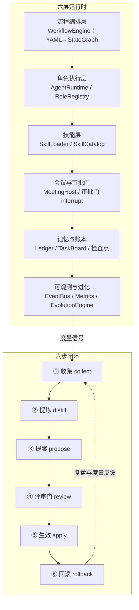

# agent-cluster-runtime — 多 Agent 组织型全栈开发集群运行时

> 版本：0.1.0 ｜ 语言：Python 3.11+ ｜ 底座：LangGraph + pydantic v2 ｜ 无 LLM 也可运行
> 设计落地自 [`agent-clusters/智能体集群设计方案.md`](../agent-clusters/智能体集群设计方案.md)（v1.0）

## 项目简介

`agent-cluster-runtime` 是一个「像企业一样运转」的多 Agent 组织型全栈开发集群运行时：
12 个岗位（产品/项目/前端/后端/算法/架构/测试/运维/文档/评审/排查/治理）按「决策—管理—执行」
三层治理组织，7 类会议以审批门（HITL interrupt）落地，YAML 流程 DSL 编译为 LangGraph
StateGraph，跑通「需求评审 → 设计评审 → 开发 → 代码评审 → 测试 → 发布评审」MVP 闭环，
并通过六步进化闭环（收集→提炼→提案→评审→生效→回滚）实现流程/组织级自我进化。

设计要点：

- **流程即配置**：SOP 用可编译的图（YAML → StateGraph）表达，进化 = 重新编译流程，可灰度、可回滚。
- **会议即审批门**：关键决策用 `interrupt`（HITL）落地，人机共治；无人值守（`--yes`）下
  bypass-immune 高风险门自动拒绝（§6.5 自动 DENY）。
- **岗位即技能**：每个岗位 = 角色画像 + 工具集 + SKILL.md 技能包 + 审批权限。
- **可观测是进化的前提**：事件流 + 检查点 + 审批审计 + 绩效度量驱动进化信号。

## 架构图



## 安装与运行

前置：Python 3.11+ 与 [uv](https://docs.astral.sh/uv/)（Windows/macOS/Linux 均可）。

```bash
# 1) 安装依赖（首次）与进入虚拟环境
uv sync

# 2) 查看 CLI 帮助（中文）
uv run agent-cluster --help

# 3) 无人值守跑通完整 MVP 闭环（--yes 自动接受全部审批，bypass-immune 门自动拒绝）
uv run agent-cluster run --flow examples/flows/fullstack-sprint.yaml --project examples --yes

# 4) 交互式运行：遇审批门打印请求并读取 accept/reject/response <内容>/edit <内容>
uv run agent-cluster run --flow examples/flows/fullstack-sprint.yaml --project examples
```

> 默认确定性模型后端（`DeterministicClient`），无需任何 API key；接入真实 LLM 时替换
> `AgentConfig.model.model_name`（如 `openai/gpt-4o-mini`）并提供对应环境变量。

## CLI 用法

| 命令 | 说明 |
|---|---|
| `agent-cluster run --flow <yaml> [--project <dir>] [--yes] [--thread <id>]` | 编译并运行 YAML 流程；`--yes` 无人值守自动审批 |
| `agent-cluster skills list --root <dir>` | 列出技能目录（name/version/description） |
| `agent-cluster roles list` | 列出 12 岗位（id/name/kind/approval_scope） |
| `agent-cluster proposals demo` | 六步进化闭环演示（collect→distill→propose→review→apply→rollback） |
| `agent-cluster metrics demo` | 度量采集与阈值信号演示 |

`python -m agent_cluster` 与 `agent-cluster` 等价；`main()` 返回 int 退出码（0 成功，1 失败）。

### 示例流程说明

`examples/flows/fullstack-sprint.yaml` 的完整 MVP 链：

```text
start → requirement_review(会议) → requirement_gate(需求确认门) → design(架构师)
→ design_review(会议) → design_gate(设计门) → develop_parallel(前后端并行)
→ code_review(会议) → test(QA) → iteration_gate(迭代验收门) → release(运维)
→ release_gate(发布门) → end
```

返工边：`requirement_gate.reject → requirement_review`；`design_gate.reject → design`；
`iteration_gate.reject → test`；`release_gate.reject → release`。`max_iterations=40`
（节点总数 15，含返工余量），编译期校验必须 ≥ 节点总数。

## 模块导览

| 模块 | 职责 |
|---|---|
| `agent_cluster.models` | pydantic v2 数据模型：Role/Agent/Task/Meeting/Proposal/Skill/Ledger/ApprovalGate/Message/ClusterState/Event 与 GateKind 等枚举 |
| `agent_cluster.skills` | SKILL.md 加载（frontmatter/正文/资源分类）、注册去重、按角色挂载与三级渐进披露 |
| `agent_cluster.workflow` | YAML 流程 DSL 解析与校验、编译为 LangGraph StateGraph、事件流运行、parallel 并行与 gate 条件路由 |
| `agent_cluster.gates` | 审批门（interrupt HITL）、bypass-immune 无人值守策略、`approval_pending` 查询挂起请求 |
| `agent_cluster.roles` | 12 岗位目录（goal/backstory/skills/tools/approval_scope）与 RoleRegistry（会议默认参与岗位） |
| `agent_cluster.runtime` | AgentRuntime（reply/observe）、ChatModelClient 抽象（默认确定性后端）、EventBus、agent 节点 handler |
| `agent_cluster.meetings` | MeetingHost 7 类会议模板 + meeting 节点 handler（纪要/决策/行动项） |
| `agent_cluster.ledger` | LedgerStore 任务账本 + TaskBoard 任务板（Backlog/Ready/InProgress/Review/Done 流转） |
| `agent_cluster.evolution` | 六步进化闭环（collect→distill→propose→review→apply→rollback）+ 审计 + 禁止自我扩权 |
| `agent_cluster.metrics` | MetricsCollector 度量采集 + MetricRules 阈值规则引擎（产出进化信号） |
| `agent_cluster.cli` | `agent-cluster` 命令行入口（run/skills/roles/proposals/metrics） |

## 参考项目映射表

> 本方案为组合式架构：借鉴下表项目设计思想，不复制其运行时代码；`gpt-pilot`（自定义许可）
> 与 `autogen`（CC-BY-4.0）**仅参考不运行**。

| 参考项目 | 许可 | 借鉴内容 | 本方案组件 |
|---|---|---|---|
| MetaGPT | MIT | 软件公司角色模式、SOP 串联、角色化 agent 行动 | `roles.py`（12 岗位）、`runtime.py`（AgentRuntime） |
| ChatDev | Apache-2.0 | YAML 流程 DSL、loop_counter 防死循环、多角色对话协作 | `workflow.py`（YAML→StateGraph、max_iterations） |
| GPT Pilot | 自定义 | 任务状态机、规格/前端/排查岗位分工 | `runtime.py`、`roles.py`（仅设计参考，不运行） |
| CrewAI | MIT | 角色画像（role/goal/backstory）、Flow 监听/路由/人工反馈 | `roles.py`（Role 模型）、`workflow.py`（条件路由） |
| AutoGen | CC-BY-4.0 | 群聊多 Agent、反思与终止条件（仅设计参考，不运行） | `meetings.py`（会议子图设计思想） |
| AgentScope | Apache-2.0 | Agent 配置四件套（Model/ReAct/Injection/Context）、事件驱动 | `models.py`（AgentConfig）、`runtime.py`（EventBus） |
| LangGraph | MIT | StateGraph 编排、interrupt 审批门、检查点续跑、时间旅行审计 | `workflow.py`、`gates.py`（流程底座） |
| anthropic-skills | 混合 | SKILL.md 技能包标准与渐进披露 | `skills.py`（SkillLoader/SkillCatalog）、`examples/skills/` |

## 许可与致谢

- 本项目代码许可：MIT（见各文件头声明约定；仓库内未附 LICENSE 文件时按 MIT 理解）。
- 设计依据：[`agent-clusters/智能体集群设计方案.md`](../agent-clusters/智能体集群设计方案.md)
  及其 8 份参考项目研读（`agent-clusters/docs/`）。
- 参考项目许可提示：`gpt-pilot` 为自定义许可（已停止维护且曾遭供应链投毒，**切勿运行源码**）；
  `autogen` 为 CC-BY-4.0；两者仅作设计参考，本方案不复用其代码。
- 致谢 MetaGPT / ChatDev / GPT Pilot / CrewAI / AutoGen / AgentScope / LangGraph /
  anthropic-skills 开源社区为多 Agent 协作提供的设计范式。