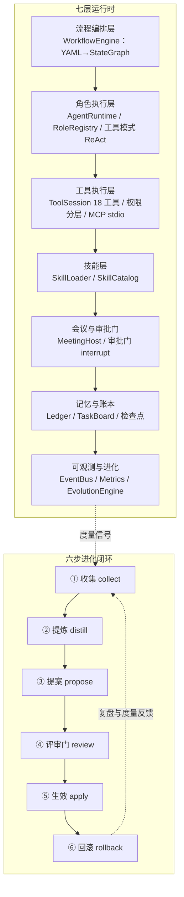

# 产品介绍：agent-cluster-runtime

> 多 Agent 组织型全栈开发集群运行时 —— 让 AI 像一家成熟软件公司一样运转。
> 版本：0.2.0 ｜ 底座：Python 3.11+ / LangGraph / pydantic v2 ｜ 默认零 LLM 依赖可运行

---

## 1. 一句话定位

`agent-cluster-runtime` 是一个「像企业一样运转」的多 Agent 组织型全栈开发集群运行时：
12 个专业岗位按「决策—管理—执行」三层治理组织，7 类会议驱动协作，关键决策由审批门
（人机共治 HITL）把关，YAML 流程 DSL 编译为 LangGraph 状态图，并内置「收集→提炼→
提案→评审→生效→回滚」六步自我进化闭环。

## 2. 背景与问题

单 Agent 编程助手擅长「完成一段代码」，但真实软件开发是组织行为：

- **角色缺失**：没人收集需求、评审设计、把控质量、跟踪进度、负责发布。
- **过程缺失**：需求直接进编码，没有评审门、没有返工回路、没有复盘。
- **决策缺失**：关键变更没有审批记录，无法审计、无法回滚。
- **经验不沉淀**：项目做完，方法论、技能、SOP 全部丢失，下一个项目从零开始。

`agent-cluster-runtime` 的目标是把「软件公司的组织、流程、技能、治理」抽象为可运行的
软件：Agent 不再是孤立的对话助手，而是一个有岗位、有会议、有门禁、有度量、能自我进化的
虚拟研发组织。

## 3. 产品定位与差异化

| 对比维度 | 单 Agent 助手 | 简单多 Agent 编排 | **agent-cluster-runtime** |
|---|---|---|---|
| 组织 | 无 | 平级对话 | 决策/管理/执行三层 + 12 岗位 |
| 过程 | 无 | 无 | 会议 + 审批门 + 返工边 + 敏捷节奏 |
| 决策 | 无审计 | 无审计 | 审批记录全量留存（append-only） |
| 进化 | 无 | 无 | 六步闭环：技能/经验/SOP/组织可进化 |
| 可观测 | 无 | 事件日志 | 事件流 + 检查点 + 度量信号 |
| 模型 | 固定 | 固定 | 可插拔：deterministic / DeepSeek / OpenAI / Codex 当前模型 |
| 流程 | 不可控 | 弱可控 | YAML 流程 DSL → 编译期校验 → 图执行 |

## 4. 核心特性

1. **完整组织架构**：12 岗位覆盖产品经理（需求收集、竞品分析、PRD）、项目经理（任务
   拆分、排期、会议主持）、架构师（系统设计）、前端/后端/算法/测试/运维工程师，以及
   文档、评审、排查、治理四类辅助岗位。
2. **三层治理**：决策层（PM/架构/治理）→ 管理层（PMO/评审）→ 执行层（开发/测试/运维），
   岗位带审批权限（`approval_scope`），权限即契约。
3. **会议驱动协作**：7 类会议模板（启动会/需求评审/设计评审/每日站会/代码评审/复盘会/
   发布评审），自动生成纪要、决策与行动项。
4. **审批门（HITL）**：6 类门（需求确认/设计评审/迭代验收/发布/进化生效/危险工具），
   LangGraph `interrupt` 挂起等待人工结论；`--yes` 无人值守时高风险门自动拒绝
   （bypass-immune）。
5. **流程即配置**：SOP 用 YAML 表达（节点 + 边 + 条件路由 + 并行），编译期校验，
   进化 = 重新编译流程，可灰度、可回滚。
6. **自我进化闭环**：收集度量信号 → 提炼候选 → 提案（必带回滚方案）→ 评审门 → 生效 →
   回滚，全程审计，禁止 Agent 自我扩权。
7. **绩效度量**：质量/效率/返工/满意度四类指标 + 阈值规则引擎，产出进化信号。
8. **技能包系统**：SKILL.md 标准（frontmatter + 正文 + 资源分类），按角色挂载、三级
   渐进披露。
9. **模型可插拔**：统一 `ChatModelClient` 抽象；默认确定性后端零依赖可跑通全流程；
   可一键切换 DeepSeek（`deepseek-*` / `codex`）或 OpenAI（`gpt-*`）。
10. **可观测与审计**：append-only 事件流 + 检查点 + 审批记录 + 任务账本/任务板。
11. **工具执行层（v0.2）**：岗位 Agent 在**真实工作区**读文件、改代码、跑测试、走 git，
    最终产出可运行代码库；18 个内置工具按 read / workspace_write / dangerous 三级权限
    分层，危险工具走审批门；模型双轨协议（原生 function calling + 文本 JSON action
    回退）；MCP stdio 外部工具可插拔。

## 5. 系统架构



执行模型：用户提供 YAML 流程 → 编译为 LangGraph StateGraph → 逐节点执行（会议/岗位/
门/并行）→ 遇门挂起等待人工 → 恢复续跑（检查点）→ 结束输出任务板、会议纪要、审批审计。

## 6. 岗位体系（12 岗三层治理）

| 岗位 id | 岗位 | 类别 | 审批范围 |
|---|---|---|---|
| pm | 产品经理 | 决策 | 需求确认、迭代验收、发布 |
| architect | 架构师 | 决策 | 设计评审 |
| governance | 治理与流程 Agent | 决策 | 进化生效 |
| pmo | 项目经理 / Scrum Master | 管理 | 迭代验收 |
| reviewer | 代码评审员 | 管理 | - |
| docs | 规格文档写手 | 管理 | - |
| frontend | 前端开发工程师 | 执行 | - |
| backend | 后端开发工程师 | 执行 | - |
| algorithm | 算法工程师 | 执行 | - |
| qa | 测试开发工程师 | 执行 | 迭代验收 |
| devops | 运维工程师 | 执行 | 发布 |
| debugger | 缺陷排查工程师 | 执行 | - |

## 7. 会议与决策机制

| 会议 | 类型 | 默认参与者 | 产出 |
|---|---|---|---|
| 启动会 | kickoff | PM/PMO/架构/前端/后端/QA/运维 | 目标与范围基线 |
| 需求评审 | requirement_review | PM/架构/前端/后端/QA | 需求确认结论 |
| 设计评审 | design_review | 架构/PMO/前端/后端/QA/运维 | 设计决策 |
| 每日站会 | daily_standup | 全员 | 进度/阻塞/行动项 |
| 代码评审 | code_review | 前端/后端/评审员 | LGTM 或整改意见 |
| 复盘会 | retro | 全员 | 改进行动项 |
| 发布评审 | release_review | PM/PMO/运维/QA | 发布放行结论 |

关键决策不依赖「口头共识」：会议纪要与行动项写入共享状态，重大节点由审批门强制人工确认，
全程留痕。

## 8. 流程 DSL 与状态图

示例 `examples/flows/fullstack-sprint.yaml` 的完整 MVP 链：

```text
start → 需求评审(会议) → 需求确认门 → 设计(架构师) → 设计评审(会议) → 设计门
→ 前后端并行开发 → 代码评审(会议) → 测试(QA) → 迭代验收门 → 发布(运维) → 发布门 → end
```

- 节点类型：`start` / `end` / `agent`（挂载岗位）/ `meeting`（挂载会议）/ `gate`（挂载
  审批门）/ `parallel`（并行子节点）。
- 门节点支持条件路由：`on_accept` / `on_reject` / `on_edit`（拒绝/修改后回流返工）。
- `max_iterations` 编译期校验必须 ≥ 节点总数，防止死循环。

## 9. 自我进化闭环

```text
① 收集 collect（度量信号/评审结果/运行事件）
   ↓
② 提炼 distill（候选进化项）
   ↓
③ 提案 propose（目标：skill/knowledge/process/organization；必带回滚方案）
   ↓
④ 评审门 review（治理层审批，禁止自我扩权）
   ↓
⑤ 生效 apply（重新编译流程/技能/组织配置）
   ↓
⑥ 回滚 rollback（按预案回退，审计留痕）
```

进化对象覆盖四类：**技能包**（SKILL.md 增改）、**经验库**（知识沉淀）、**SOP/流程**
（YAML 流程节点增删改）、**组织流程**（角色分工/会议频率/流程节点）。

## 10. 绩效度量与信号

内置 `MetricsCollector` + `MetricRules` 阈值规则引擎，指标包括：

- 质量：评审通过率、缺陷密度、返工率
- 效率：任务完成数、迭代吞吐、门等待时长
- 治理：行动项关闭率、循环迭代次数

超过阈值触发进化信号（severity 分级），作为进化闭环的输入。

## 11. 模型接入

| 模型名 | 后端 | 说明 |
|---|---|---|
| `deterministic`（缺省） | DeterministicClient | 规则回复，零 API 依赖，测试/演示 |
| `deepseek-*` | DeepSeekClient | 直连 `api.deepseek.com`，读 `DEEPSEEK_API_KEY`，自动扩容重试、思维链不外泄 |
| `codex` / `custom` | 自动解析 | 读取 Codex `config.toml` 当前对话所用模型 |
| `openai` / `gpt-*` / `o1` / `o3` | OpenAIClient | 读 `OPENAI_API_KEY` |

优先级：岗位偏好模型 > 运行时默认模型（`--model` / `DEEPSEEK_MODEL`）> deterministic。

工具模式（v0.2）采用**双轨工具协议**：DeepSeek / OpenAI 走原生 `tools` 参数并解析
`tool_calls`；不支持原生工具调用的模型回退解析回复中的 fenced JSON action
（`{"name": ..., "args": {...}}`）。

## 12. 技术栈

- Python 3.11+（`from __future__ import annotations`，类型标注贯穿）
- LangGraph（StateGraph 编排、interrupt 审批门、检查点续跑）
- pydantic v2（全量数据模型）
- PyYAML（流程 DSL 解析）
- 运行依赖极简：`pydantic / langgraph / langgraph-checkpoint / PyYAML`（模型直连走 stdlib）
- v0.2 工具执行层：stdlib `subprocess` + `asyncio` 实现工具会话与 MCP stdio 客户端
  （JSON-RPC 2.0，无新增硬依赖；`mcp` 官方包为可选 extra）

## 13. 设计参照与组合式架构

| 参考项目 | 许可 | 借鉴内容 | 本方案组件 |
|---|---|---|---|
| MetaGPT | MIT | 软件公司角色、SOP 串联 | `roles.py` / `runtime.py` |
| ChatDev | Apache-2.0 | YAML 流程 DSL、防死循环 | `workflow.py` |
| GPT Pilot | 自定义（仅参考不运行） | 任务状态机、岗位分工 | `runtime.py` / `roles.py` |
| CrewAI | MIT | 角色画像、Flow 路由 | `roles.py` / `workflow.py` |
| AutoGen | CC-BY-4.0（仅参考不运行） | 群聊、反思、终止条件 | `meetings.py` |
| AgentScope | Apache-2.0 | Agent 配置四件套、事件驱动 | `models.py` / `runtime.py` |
| LangGraph | MIT | StateGraph、interrupt、检查点 | `workflow.py` / `gates.py` |
| anthropic-skills | 混合 | SKILL.md 标准与渐进披露 | `skills.py` / `examples/skills/` |

> 本方案为组合式架构：借鉴上述项目的设计思想，不复制其运行时代码；`gpt-pilot` 与
> `autogen` 仅作设计参考，不运行其源码。

## 14. 当前能力边界与路线图

**已实现（0.2.0）**

- 七层运行时全链路：模型 → 流程 → 角色 → 工具 → 技能 → 会议/门 → 账本 → 度量 → 进化。
- YAML 流程 DSL 编译与校验、并行执行、条件路由、interrupt/resume。
- 12 岗位目录、7 类会议模板、6 类审批门、六步进化闭环、绩效度量。
- DeepSeek / Codex 当前模型接入（含截断扩容重试与思维链防护）。
- **工具执行层（v0.2）**：18 内置工具 + 三级权限分层 + 工作区路径越界拦截 + 危险工具
  审批门（interrupt，`--yes` 自动拒绝）；模型双轨协议（原生 function calling + 文本
  JSON action 回退）；MCP stdio 外部工具；分岗位质量门槛（QA 真实测试通过才 Done）；
  `git_init/git_add/git_commit` 支撑新项目从空目录到可运行仓库。
- 288 项自动化测试；确定性工具脚本与真实 LLM 双模式可跑通两场景验收（空工作区新项目 /
  既有 git 仓库功能开发）。

**路线图（后续版本）**

- 工具执行层增强：git 分支隔离、Docker 沙箱、浏览器/网络工具（可由 MCP 提供）。
- 记忆持久化：经验库从内存到文件/向量库，跨迭代沉淀。
- 多项目并发与项目组合管理。
- 图形化流程编辑器与运行面板。
- 企业集成：Jira/Linear/Slack 等外部系统适配。

## 15. 许可说明

- 仓库内暂未附 LICENSE 文件；代码文件头声明约定按 MIT 理解，正式商用/分发前请补充
  LICENSE 文件并咨询法务。
- 设计参照项目的许可提示：`gpt-pilot` 自定义许可（已停止维护、曾遭供应链投毒，切勿
  运行其源码）；`autogen` CC-BY-4.0；两者仅设计参考，本仓库不复用其代码。
