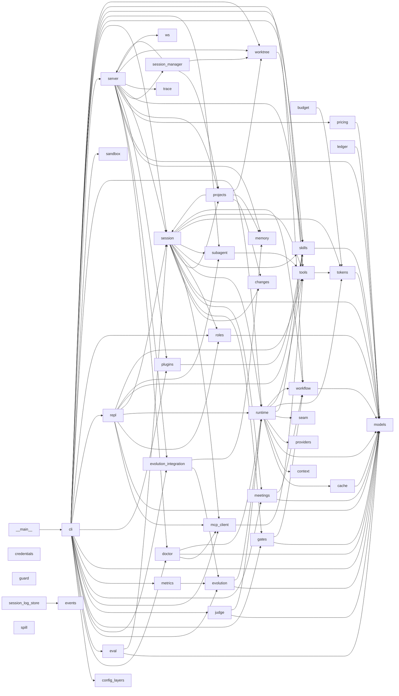

# 模块依赖图（module-graph）

> 由 `scripts/gen_module_graph.py` 生成，勿手改；`scripts/verify_module_graph.py` 校验 freshness。

```mermaid
flowchart LR
    __main__[__main__]
    budget[budget]
    cache[cache]
    changes[changes]
    cli[cli]
    config_layers[config_layers]
    context[context]
    credentials[credentials]
    doctor[doctor]
    eval[eval]
    events[events]
    evolution[evolution]
    evolution_integration[evolution_integration]
    gates[gates]
    guard[guard]
    judge[judge]
    ledger[ledger]
    mcp_client[mcp_client]
    meetings[meetings]
    memory[memory]
    metrics[metrics]
    models[models]
    plugins[plugins]
    pricing[pricing]
    projects[projects]
    providers[providers]
    repl[repl]
    roles[roles]
    runtime[runtime]
    sandbox[sandbox]
    seam[seam]
    server[server]
    session[session]
    session_log_store[session_log_store]
    session_manager[session_manager]
    skills[skills]
    spill[spill]
    subagent[subagent]
    tokens[tokens]
    tools[tools]
    trace[trace]
    workflow[workflow]
    worktree[worktree]
    ws[ws]
    __main__ --> cli
    budget --> tokens
    cache --> models
    cli --> config_layers
    cli --> doctor
    cli --> eval
    cli --> evolution
    cli --> evolution_integration
    cli --> gates
    cli --> judge
    cli --> mcp_client
    cli --> meetings
    cli --> metrics
    cli --> models
    cli --> plugins
    cli --> repl
    cli --> roles
    cli --> runtime
    cli --> sandbox
    cli --> server
    cli --> session
    cli --> skills
    cli --> subagent
    cli --> tools
    cli --> workflow
    cli --> worktree
    doctor --> mcp_client
    doctor --> models
    doctor --> runtime
    eval --> models
    eval --> session
    evolution --> models
    evolution --> runtime
    evolution_integration --> evolution
    evolution_integration --> memory
    gates --> models
    gates --> workflow
    judge --> models
    judge --> runtime
    ledger --> models
    mcp_client --> tools
    meetings --> models
    meetings --> workflow
    metrics --> evolution
    plugins --> skills
    pricing --> models
    projects --> changes
    projects --> memory
    projects --> session
    projects --> worktree
    repl --> mcp_client
    repl --> models
    repl --> roles
    repl --> runtime
    repl --> session
    repl --> skills
    repl --> subagent
    repl --> tools
    roles --> models
    runtime --> cache
    runtime --> context
    runtime --> models
    runtime --> providers
    runtime --> seam
    runtime --> skills
    runtime --> tokens
    runtime --> tools
    runtime --> workflow
    server --> doctor
    server --> evolution_integration
    server --> memory
    server --> models
    server --> plugins
    server --> pricing
    server --> projects
    server --> session
    server --> session_manager
    server --> skills
    server --> trace
    server --> worktree
    server --> ws
    session --> changes
    session --> gates
    session --> mcp_client
    session --> meetings
    session --> models
    session --> projects
    session --> roles
    session --> runtime
    session --> skills
    session --> subagent
    session --> tokens
    session --> tools
    session --> workflow
    session_log_store --> events
    session_manager --> projects
    session_manager --> server
    session_manager --> worktree
    skills --> models
    subagent --> tools
    tokens --> models
    tools --> tokens
    workflow --> models
    worktree --> tools
```
